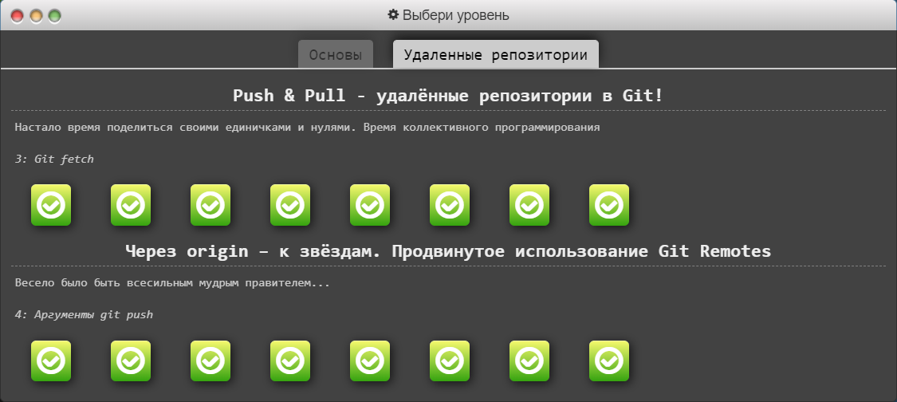

# kottans-frontend

---

## Curriculum:

**General**
- [x] **0.** [Git Basics](#git-basics)
    - Course: Version Control with Git
    - Course: Learn Git branching
- [x] **1.** [Linux CLI and Networking](#linux-cli-and-http)
    - Course: Linux Survival
    - Article: HTTP: The Protocol Every Web Developer Must Know - Part 1
    - Article: HTTP: The Protocol Every Web Developer Must Know - Part 2
- [x] **2.** [VCS (hello gitty), GitHub and Collaboration](#git-collaboration)
    - Course: GitHub & Collaboration
    - Course: Learn Git branching (last levels)

**Front-End Basics**
- [x] **3.** [Intro to HTML & CSS](#intro-to-html-and-css)
    - Course: Intro to HTML & CSS (Udasity)
    - Course: Learn HTML(Codeacademy)
    - Course: Learn CSS(Codeacademy)
- [x] **4.** [Responsive Web Design](#responsive-web-design)
    - Course: Responsive Web Design Fundamentals
    - Game: Flexbox froggy
- [ ] **5.** [HTML & CSS Practice]()
- [ ] **6.** [JavaScript Basics]()
- [ ] **7.** [Document Object Model]() - practice

**Advanced Topics**
- [ ] **8.** [Building a Tiny JS World (pre-OOP)]() - practice
- [ ] **9.** [Object oriented JS]() - practice
- [ ] **10.** [OOP exercise]() - practice
- [ ] **11.** [Offline Web Applications]()
- [ ] **12.** [Memory pair game]() — real project!
- [ ] **13.** [Website Performance Optimization]()
- [ ] **14.** [Friends App]() - real project!

---

## General

---

### Git Basics

#### Version Control with Git
Got a basic knowledge of how git works, which is very interesting for those who have not worked with version control systems.
I really liked how the visualization of git commands was done.

Screenshot

### Linux CLI and HTTP

#### Linux Survival

As a Windows system user, I was very interested in learning more about Linux. Commands that are used in Linux can also be used in Git.

Screenshot

Screenshot

Screenshot

Screenshot

---

### Git Collaboration

#### Course: GitHub & Collaboration

This course is a continuation of the Git Basics course. Acquainted and practiced in the collective use of git. I have not had this experience yet, it was interesting.

Screenshot

Screenshot

#### Course: Learn Git branching (last levels)

I took the course and completed it.

Screenshot

Screenshot

---

### Intro to HTML and CSS

Completed a course in HTML and CSS. Completed practical tasks.From useful things, I finally understood how tables work.Refreshed basic knowledge.

Course: Intro to HTML & CSS (Udasity)

Screenshot

Screenshot

Course: Learn HTML(Codeacademy)

Screenshot

Course: Learn CSS(Codeacademy)

Screenshot

Course: Learn HTML+CSS(Codeacademy)

Screenshot

### Responsive Web Design

Familiarized with the basics of FLEXBOX and CSS GRID. While doing visual practice on Froggy and Garden, I understood the basics on a visual example. It was interesting!

Screenshot

Screenshot

